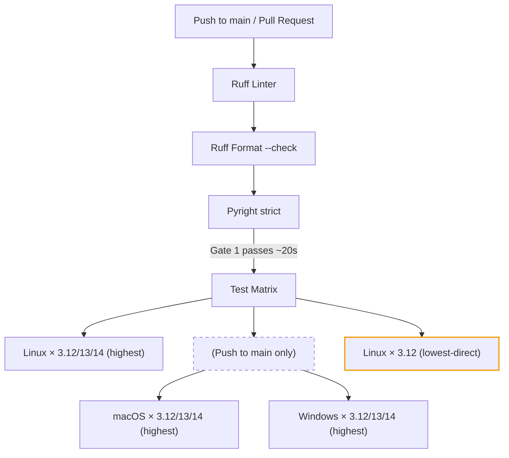

# Pillar 3 — Continuous Integration and Delivery (CI/CD)

> **Files involved:**
> `.github/workflows/ci.yml` · `.github/workflows/publish.yml` ·
> `pyproject.toml` (sections `[tool.pytest]`, `[tool.coverage]`)

The CI/CD pipeline is not a linear sequence of scripts; it is a **Directed Acyclic
Graph (DAG)** designed under the **Fail Fast** paradigm: cheap checks run first
and expensive ones only run if the first ones pass. The pipeline runs on
[GitHub Actions](https://docs.github.com/en/actions).

---

## 3.1 CI Pipeline Anatomy

### The Validation DAG



**Why this order?** It's a cost pyramid:

| Gate | Time | Cost | What Does It Validate? |
|------|--------|-------|---------------|
| Ruff Lint | ~2s | Near zero | Syntax errors, security, style |
| Ruff Format | ~1s | Near zero | Format consistency |
| Pyright | ~15s | Low | Type errors, null safety |
| Test Matrix | ~2-5 min | Variable | Correct logic across Linux (PRs) or full OS matrix (main) |

There is no point provisioning multiple test containers if the code has a misspelled
import. Fail Fast saves money and time. Optimized for GitHub Pro with an automated
OS matrix filter: only runs Ubuntu on PRs to save minutes, and full OS support
on `main`.

### Complete Workflow: `.github/workflows/ci.yml`

#### Triggers and Concurrency

```yaml
on:
  push:
    branches: ["main"]       # Only the main branch
  pull_request:               # All PRs

concurrency:
  group: ${{ github.workflow }}-${{ github.ref }}
  cancel-in-progress: true    # ← CRITICAL
```

The **concurrency** directive is a financial and operational optimization:

- If a developer pushes to a branch that already has a running pipeline, the
  previous pipeline is **canceled immediately**.
- Without this directive, each push would accumulate queued pipelines, consuming
  resources unnecessarily.
- The `group` is composed of workflow + ref (branch), so pipelines from different
  branches run in parallel without interfering.

#### Job 1: Static Analysis

```yaml
static-analysis:
  runs-on: ubuntu-latest
  steps:
    - uses: actions/checkout@v4

    - uses: astral-sh/setup-uv@v7
      with:
        enable-cache: true         # ← Caches uv's global cache

    - run: uv sync --locked --all-extras --dev    # ← --locked is the key

    - run: uv run ruff check .
    - run: uv run ruff format --check .
    - run: uv run pyright
```

Key points:

- **[`astral-sh/setup-uv`](https://github.com/astral-sh/setup-uv)**: Official Astral action that installs uv and automatically
  configures the cache using GitHub Actions storage APIs.
- **`enable-cache: true`**: Caches downloaded packages between runs.
  The second run of a PR is dramatically faster.
- **`--locked`**: Ensures `uv.lock` is synchronized with `pyproject.toml`.
  If someone modified `pyproject.toml` without regenerating the lockfile, CI **fails**
  before running any tool.
- **`--all-extras`**: Installs all extras defined in the project.
- **`--dev`**: Installs development dependencies (ruff, pyright, pytest...).

#### Job 2: Test Matrix

```yaml
test:
  needs: static-analysis       # ← Dependency: won't start without Gate 1
  runs-on: ${{ matrix.os }}
  strategy:
    fail-fast: false            # ← Runs the ENTIRE matrix even if something fails
    matrix:
      # Dynamic OS selection: all on main, Linux only on PRs (to save minutes)
      os: ${{ (github.event_name == 'push' && github.ref == 'refs/heads/main') && fromJSON('["ubuntu-latest", "macos-latest", "windows-latest"]') || fromJSON('["ubuntu-latest"]') }}
      python-version: ["3.12", "3.13", "3.14"]
      resolution: [highest]
      include:
        - os: ubuntu-latest
          python-version: "3.12"
          resolution: lowest-direct
  env:
    UV_PYTHON: ${{ matrix.python-version }}
```

| Parameter | Value | Justification |
|-----------|-------|---------------|
| `needs: static-analysis` | Strict dependency | Don't waste compute if lint/types fail |
| `fail-fast: false` | Run entire matrix | If it fails on Windows (on main), investigate why |
| `UV_PYTHON` | Environment variable | Overrides uv's Python version for each matrix cell |
| **All OS × 3 Python** | Var. combinations | Linux-only for dev speed/cost; Full matrix for release stability |
| **`resolution: lowest-direct`** | 1 extra combination | Validates dependency lower bounds (see below) |

##### Dependency Resolution Strategy

The matrix includes a `resolution` dimension with two values:

| Resolution | Behavior | Purpose |
|---|---|---|
| `highest` (default) | Installs the **latest** version of each dependency that satisfies the constraint | Standard testing: does the code work with current dependencies? |
| `lowest-direct` | Installs the **minimum** version of each direct dependency that satisfies the `>=` constraint | Lower bound validation: does `>=1.0` actually work with `1.0`? |

The `lowest-direct` job runs on Ubuntu only (single combination) to minimize
cost. It catches a common and subtle class of bugs: declaring `pydantic>=2.0`
in `pyproject.toml` while the code uses a method introduced in Pydantic 2.6.
Without this test, the lower bound is a lie.

```yaml
- name: Install dependencies (${{ matrix.resolution }})
  run: uv sync --locked --all-extras --dev --resolution=${{ matrix.resolution }}
```

The `--resolution` flag instructs `uv sync` to resolve dependencies using the
specified strategy. Each resolution variant uses a separate cache (via
`cache-suffix`) to prevent cross-contamination between dependency trees.

##### The Test

```yaml
- run: uv run pytest --cov=src --cov-report=term-missing
```

Runs [pytest](https://docs.pytest.org/) with code coverage targeting the `src/` directory. The
`--cov-report=term-missing` flag shows in the output exactly which lines are
not covered.

##### Cache Cleanup

```yaml
- run: uv cache prune --ci
```

`uv cache prune --ci` removes leftover artifacts from the cache after tests.
This optimizes the cache size stored by GitHub Actions, reducing download latency
in subsequent PRs.

---

## 3.2 Code Coverage

### What Is Coverage?

Code coverage measures what percentage of source code lines (and branches) are
executed during tests. [Coverage.py](https://coverage.readthedocs.io/) is the standard
tool used to measure it. It is not a measure of **quality** (a test can execute code
without verifying its result), but it establishes a **lower bound**: if a line
is never executed in any test, it is impossible for it to be verified.

### Template Configuration

```toml
[tool.coverage.run]
source = ["src"]          # Only measure coverage of production code
branch = true             # Measure BRANCH coverage, not just lines
```

**Branch coverage** is significantly stricter than line coverage:

```python
def validate(x: int) -> str:
    if x > 0:
        return "positive"
    return "non-positive"
```

- **Line coverage 100%**: Just calling `validate(1)` and `validate(0)` suffices.
- **Branch coverage 100%**: Requires testing both branches of the `if`: one call
  with `x > 0` true and another with `x > 0` false.

### The Threshold: `fail_under = 100`

```toml
[tool.coverage.report]
fail_under = 100           # ← Blocks the PR if coverage drops below 100%
show_missing = true        # Shows exactly which lines are missing
precision = 2              # Two decimal places (99.99% ≠ 100%)
```

**Is 100% coverage realistic?** Yes, in mission-critical infrastructure repositories
(like Pydantic). The key is **legitimate and auditable exclusions**:

```toml
exclude_lines = [
    "pragma: no cover",              # Explicit exclusion (requires justification in review)
    "if TYPE_CHECKING:",             # Only runs during static analysis
    "@overload",                     # Overload stubs (not real code)
    "@abstractmethod",              # Abstract methods without implementation
    "raise NotImplementedError",     # Methods that must be implemented by subclasses
    "\\.\\.\\.",                     # Protocol/Abstract bodies with `...`
]
```

If a code block is genuinely unreachable or is type plumbing, it is excluded
with `pragma: no cover` — but **human review of the PR must justify each exclusion**.

---

## 3.3 Pytest Configuration

```toml
[tool.pytest.ini_options]
testpaths = ["tests"]
xfail_strict = true            # If an @xfail test passes, it's an ERROR
filterwarnings = ["error"]     # All warnings become errors
addopts = ["--strict-markers", "--strict-config", "-ra"]
```

| Option | Effect |
|--------|--------|
| `xfail_strict = true` | If you mark a test as "expected to fail" (`@pytest.mark.xfail`) and that test **passes**, pytest reports it as an error. This prevents silently fixed tests from remaining marked as xfail indefinitely. |
| `filterwarnings = ["error"]` | Converts **all Python warnings** into errors. Silent deprecations, ResourceWarnings, and false assumptions from third-party libraries crash the test immediately instead of going unnoticed. |
| `--strict-markers` | Forbids undeclared markers. If you write `@pytest.mark.slwo` (typo), pytest fails instead of silently ignoring it. |
| `--strict-config` | Raises an error if `pyproject.toml` contains unknown pytest options. |
| `-ra` | At the end of the report, shows a summary of all tests that were not "passed". |

### Custom Markers

```toml
markers = [
    "slow: marks tests as slow (deselect with '-m \"not slow\"')",
    "integration: marks tests as integration tests",
]
```

Usage:

```python
import pytest

@pytest.mark.slow
def test_heavy_computation() -> None:
    ...

@pytest.mark.integration
def test_database_connection() -> None:
    ...
```

```bash
uv run pytest -m "not slow"          # Fast tests only
uv run pytest -m "integration"       # Integration tests only
```

---

## 3.4 Secure Publishing to PyPI (OIDC)

### The Problem with Static Tokens

Historically, publishing to PyPI required an API token stored as a GitHub secret.
These tokens have three problems:

1. **They are permanent** — If leaked, the attacker can publish malicious versions
   indefinitely.
2. **They require manual rotation** — Someone must remember to change them periodically.
3. **They are an attack vector** — Anyone/system with access to GitHub secrets can
   read the token.

### The Solution: Trusted Publishers (OIDC)

The modern standard completely eliminates static tokens using
[OpenID Connect](https://docs.pypi.org/trusted-publishers/):

```
GitHub Actions                              PyPI
     │                                       │
     │ 1. Generates ephemeral JWT ──────────→│
     │    (cryptographically signed)          │
     │    Claims: repo, workflow, trigger     │
     │                                       │
     │ 2. ←──────────────── 15-min API Token │
     │    (only if repo is "trusted")         │
     │                                       │
     │ 3. Uploads package with ephemeral ───→│
     │    token                               │
```

**Zero configured secrets.** GitHub issues a JWT token with cryptographic assertions
about the repository, workflow, and trigger. PyPI verifies the signature, and if
the trust relationship was previously configured, mints an API token with 15-minute
expiration.

### Workflow: `.github/workflows/publish.yml`

```yaml
on:
  release:
    types: [published]      # ← Triggers when a Release is published on GitHub
```

The trigger is deliberate: publishing only happens when a maintainer creates and
publishes a Release in the GitHub UI (not on every push to main).

```yaml
permissions:
  id-token: write           # ← REQUIRED for OIDC
  contents: read
```

The `id-token: write` permission is what allows GitHub Actions to generate the JWT
token for OIDC. Without this, the publish action cannot authenticate with PyPI.

```yaml
environment:
  name: pypi                # ← GitHub Environment with additional protection
```

The **GitHub Environment** `pypi` enables additional security layers:
- Mandatory reviewers who must approve the deployment
- Restriction to specific branches (only `main`)
- Delays or waits before deployment

```yaml
- uses: pypa/gh-action-pypi-publish@release/v1
```

The official [PyPA publish action](https://github.com/pypa/gh-action-pypi-publish) handles the entire OIDC flow automatically.
Additionally, it generates **digital provenance attestations** ([PEP 740](https://peps.python.org/pep-0740/)),
digitally signing each uploaded distribution.

### Prerequisite: Configure Trusted Publisher on PyPI

Before the workflow works, you must configure the trust relationship on PyPI:

1. Go to https://pypi.org/manage/project/your-package/settings/publishing/
2. Add a "Trusted Publisher" with:
   - **Owner:** your GitHub organization
   - **Repository:** repository name
   - **Workflow:** `publish.yml`
   - **Environment:** `pypi`

---

## Pillar 3 Summary

| Component | File | Purpose |
|------------|---------|-----------|
| **Static Analysis Gate** | `ci.yml` (job 1) | Lint + Format + Types — fast, 1 runner |
| **Test Matrix** | `ci.yml` (job 2) | 3 OS × 2 Python × highest + 1 lowest-direct = 7 combinations |
| **Dependency Lower Bounds** | `ci.yml` (job 2, `lowest-direct`) | Validates that `>=X.Y` constraints are truthful |
| **Concurrency** | `ci.yml` (top-level) | Cancel obsolete pipelines |
| **Coverage 100%** | `pyproject.toml` | Branch coverage with auditable exclusions |
| **Strict Pytest** | `pyproject.toml` | xfail_strict, warnings→errors, strict-markers |
| **OIDC Publishing** | `publish.yml` | Ephemeral tokens, zero secrets, PEP 740 attestations |

[← Pillar 2: Quality](pillar-2-quality.md) · [Next: Pillar 4 — Governance →](pillar-4-governance.md)
