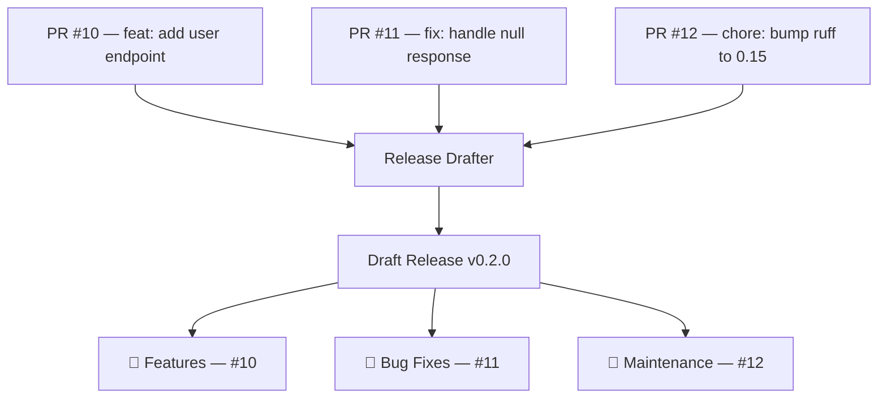
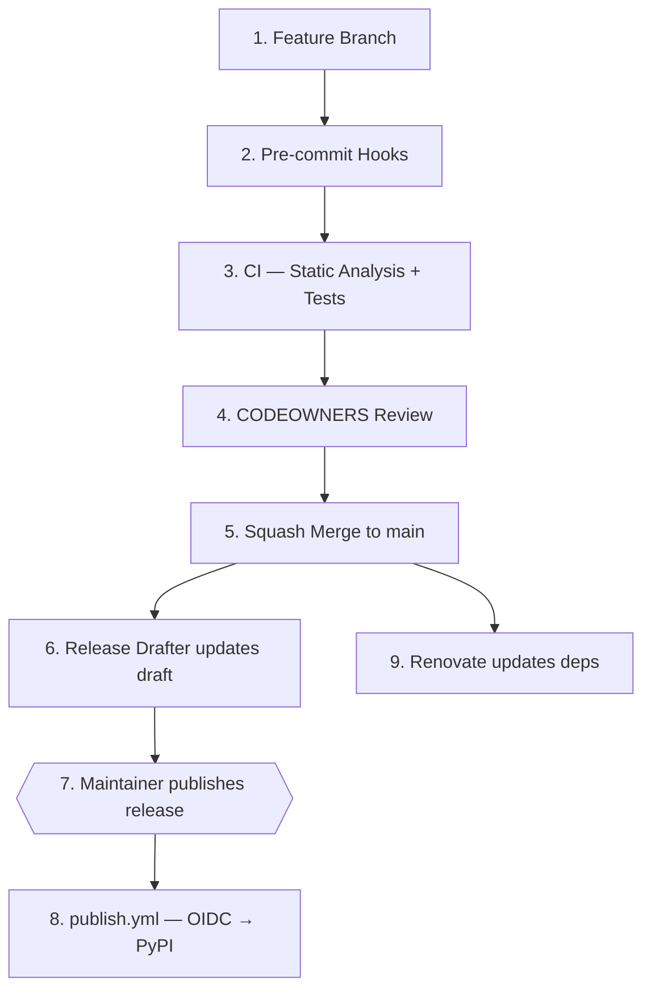

# Pillar 5 — Maintenance and Continuous Delivery

> **Files involved:**
> `renovate.json` · `.github/release-drafter.yml` ·
> `.github/workflows/release-drafter.yml` · `.github/workflows/publish.yml`

A repository is not born and abandoned. Dependencies expire, vulnerabilities are
discovered, and users expect new versions. If any of these processes depends on
manual human intervention, **it is an architectural defect**.

---

## 5.1 Renovate — Proactive Dependency Maintenance

### The Problem: Bit Rot

Software dependencies expire quickly. A library that is secure today may have a
critical vulnerability tomorrow. If nobody updates dependencies regularly, the
project silently accumulates security technical debt.

This phenomenon is called **bit rot**: the code doesn't change, but the world does,
and over time the software becomes incompatible, insecure, or obsolete.

### What Is Renovate?

[**Renovate**](https://docs.renovatebot.com/) is a bot that monitors the project's
dependencies and opens automatic Pull Requests when updates are available. It is
superior to Dependabot in:

| Aspect | Dependabot | Renovate |
|---------|------------|----------|
| **Grouping** | One PR per dependency | Can group related dependencies |
| **Automerge** | Limited | Native with configurable conditions |
| **uv support** | Partial | Complete (recognizes `uv.lock`, PEP 621) |
| **Programmability** | Minimal | Highly programmable (JSON with regex) |
| **Lockfile maintenance** | Not supported | Can regenerate lockfiles periodically |

### Configuration: `renovate.json`

```json
{
  "$schema": "https://docs.renovatebot.com/renovate-schema.json",
  "extends": ["config:recommended"],
  "lockFileMaintenance": {
    "enabled": true,
    "schedule": ["before 5am on monday"]
  },
  "packageRules": [
    {
      "matchManagers": ["pep621", "uv"],
      "matchUpdateTypes": ["minor", "patch"],
      "automerge": true,
      "automergeType": "pr"
    },
    {
      "groupName": "Linting and Formatting Toolchain",
      "matchPackageNames": ["ruff", "pyright", "pre-commit"]
    },
    {
      "groupName": "Testing",
      "matchPackageNames": ["pytest", "pytest-cov"]
    }
  ]
}
```

### Section-by-Section Anatomy

#### Base and Preset

```json
"extends": ["config:recommended"]
```

Inherits Renovate's recommended configurations, which include sensible heuristics
for most ecosystems (check frequency, default grouping rules, etc.).

#### Lockfile Maintenance

```json
"lockFileMaintenance": {
  "enabled": true,
  "schedule": ["before 5am on monday"]
}
```

**What does it do?** Every Monday before 5am, Renovate opens a PR that regenerates
`uv.lock` from scratch. This ensures that even transitive dependencies (those you
don't explicitly declare) are updated periodically.

**Why at that time?** So that when the team starts working on Monday, the PR has
already been evaluated by CI. If everything passes, it is approved quickly (or
auto-merged).

#### Automerge Rule

```json
{
  "matchManagers": ["pep621", "uv"],
  "matchUpdateTypes": ["minor", "patch"],
  "automerge": true,
  "automergeType": "pr"
}
```

**Meaning:** If a dependency receives a **minor** (e.g., 2.10 → 2.11) or **patch**
(e.g., 2.10.5 → 2.10.6) update, and CI passes completely (lint + types + tests),
Renovate **merges the PR automatically** without human intervention.

**Is it safe?** Yes, because:
1. The "Iron Wall" (Pillar 2) + Test Matrix (Pillar 3) validate the change.
2. Only minor/patch is auto-merged, not major (which may contain breaking changes).
3. The code runs against 3 OS × 2 Python versions before merge.

**What about major updates?** They remain as open PRs awaiting human review,
because they may require code changes.

#### Dependency Grouping

```json
{
  "groupName": "Linting and Formatting Toolchain",
  "matchPackageNames": ["ruff", "pyright", "pre-commit"]
}
```

**What does it do?** Instead of opening 3 separate PRs when ruff, pyright, and
pre-commit are updated, Renovate groups them into a single PR titled
*"Update Linting and Formatting Toolchain"*.

**Why group?** Without grouping, an active repository can receive dozens of
Renovate PRs per week, overwhelming maintainers and CI. Grouping dependencies
that update together reduces noise.

---

## 5.2 Release Drafter — Automatic Changelogs

### The Problem with Manual Changelogs

Writing changelogs manually is:
1. **Error-prone** — PRs get forgotten.
2. **Tedious** — Someone has to review all PRs since the last release.
3. **Inconsistent** — One maintainer writes "Fixed bug" and another "fix: resolve crash".

### What Is Release Drafter?

[**Release Drafter**](https://github.com/release-drafter/release-drafter) is a GitHub
bot that maintains a **continuously updated** Release draft. Every time a PR is
merged into `main`, Release Drafter:

1. Reads the PR's **labels** (feature, fix, chore, etc.).
2. Classifies the PR in the corresponding changelog category.
3. Calculates the next semantic version based on the labels.
4. Updates the Release draft.

### Visual Flow



### Configuration: `.github/release-drafter.yml`

#### Version Templates

```yaml
name-template: "v$RESOLVED_VERSION"
tag-template: "v$RESOLVED_VERSION"
```

Release Drafter automatically calculates `$RESOLVED_VERSION` based on the labels
of PRs merged since the last release.

#### Changelog Categories

```yaml
categories:
  - title: "🚀 Features"
    labels: ["feature", "enhancement"]
  - title: "🐛 Bug Fixes"
    labels: ["fix", "bug"]
  - title: "🧰 Maintenance & Refactoring"
    labels: ["chore", "refactor"]
  - title: "📖 Documentation"
    labels: ["docs", "documentation"]
  - title: "⚡ Performance"
    labels: ["performance", "perf"]
```

Each category maps **GitHub labels** to changelog sections. When a PR has the
`feature` label, it appears under "🚀 Features".

#### Semantic Version Resolution

```yaml
version-resolver:
  major:
    labels: ["breaking", "major"]
  minor:
    labels: ["feature", "enhancement", "minor"]
  patch:
    labels: ["fix", "bug", "chore", "refactor", "docs", "patch"]
  default: patch
```

The version is calculated by **the highest-impact label** among all PRs merged
since the last release:

- If **any** PR has the `breaking` label → Major bump (1.0.0 → 2.0.0)
- If no breaking but one has `feature` → Minor bump (1.0.0 → 1.1.0)
- If only `fix`/`chore` → Patch bump (1.0.0 → 1.0.1)

### Workflow Trigger: `.github/workflows/release-drafter.yml`

```yaml
on:
  push:
    branches: [main]         # Updates the draft when merging to main
  pull_request:
    types: [opened, reopened, synchronize]    # Auto-label PRs
```

The workflow runs at two moments:
1. **On merge to main**: Updates the draft with the newly merged PR.
2. **On PR open/update**: Can auto-assign labels based on the PR title
   (if configured with autolabeler).

---

## 5.3 The Complete Release Cycle

All elements from the 5 pillars chain together into an automated flow:



**The only manual step is #7**: a maintainer decides the draft is ready and
publishes it. Everything else is automatic.

---

## 5.4 Semantic Versioning (SemVer)

### What Is It?

[Semantic Versioning](https://semver.org/) is a versioning contract with the format
`MAJOR.MINOR.PATCH`:

```
  2  .  10  .  6
  │      │     │
  │      │     └── PATCH: bug fixes, no API change
  │      └──────── MINOR: new functionality, backward compatible
  └─────────────── MAJOR: incompatible changes (breaking changes)
```

### Relationship with Conventional Commits

| Commit/PR | Version Impact |
|-----------|--------------------|
| `fix: handle edge case` | 1.2.3 → 1.2.**4** |
| `feat: add export endpoint` | 1.2.3 → 1.**3**.0 |
| `feat!: remove legacy auth` | 1.2.3 → **2**.0.0 |

The `!` in `feat!:` marks a **breaking change**: something that breaks the public API.
Consumers of the package who pin `my-package>=1.0,<2.0` will not automatically receive
version 2.0.0, giving them time to migrate.

---

## Pillar 5 Summary

| Element | File | Purpose |
|----------|---------|-----------|
| **Renovate** | `renovate.json` | Proactive dependency maintenance |
| **Automerge** | `renovate.json` (packageRules) | Automatic merge if CI passes (minor/patch) |
| **Grouping** | `renovate.json` (groupName) | Reduce dependency PR noise |
| **Release Drafter** | `.github/release-drafter.yml` | Auto-generated changelogs from labels |
| **Automatic versioning** | Release Drafter (version-resolver) | SemVer calculated from labels |
| **OIDC Publish** | `.github/workflows/publish.yml` | Zero-secret publishing |
| **SemVer** | Team convention | Compatibility contract with users |

[← Pillar 4: Governance](pillar-4-governance.md) · [Next: Quick Start Guide →](quick-start.md)
